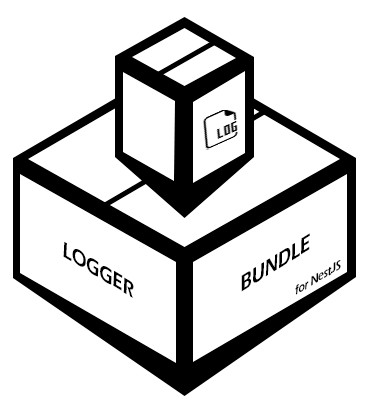

<p align="center">
  <a href="http://nestjs.com/" target="blank"></a>
</p>

<p align="center">A flexible Logger created to use with <a href="http://nodejs.org" target="blank">Nest.js</a> framework for wrap all logs with an Request or Async context in a bundle.</p>
<p align="center">
  <a href="https://www.npmjs.com/package/nest-logger-bundle"></a>
  <a href="https://github.com/pedrohcdo/nest-logger-bundle/blob/master/LICENSE"></a>
  <a href="https://snyk.io/test/github/pedrohcdo/nest-logger-bundle">
    
  </a>
  
  
  
</p>

## Description

This library made to be used with <a href="http://nodejs.org" target="blank">Nest.js</a> it offers more flexibility for controlling logs in the application. The strongest point is that it offers a way to pack all the logs originating from an request or some asynchronous flow into a single bundle, you can also decide what to do with this bundle as well as regular logs.

For example, in a request several logs can occur and organizing this later or finding yourself in the middle of so many logs becomes a complicated task, with the `LoggerBundle` all the logs that occur in that request will be packed in a bundle and this bundle shows exactly the order that these logs were occurred using a tree, you can even create branches of these logs using the `enter()/ exit()` methods as will be explained later. This bundle will include a lot of useful information, such as the request that originated these logs and in the log tree you will be able to see a time profiling telling you how long it took in each branch tree.

Inside it works based on a context, be it a request or an asynchronous flow, so you can inject the `LoggerBundle` into any desired service and all calls between these services work correctly, so all logs occurring in a given request will be packed in the same bundle.

________________

## Installation

```bash
$ npm i --save nest-logger-bundle
```


________________

## Internal Dependencies

You don't need to install any extra dependencies. Internally this library is also made using some bases that are made on top of the <a href="https://github.com/pinojs/pino" target="blank">pino</a>. If you need to use some transporter you will need to configure the streams, for that, follow this [section](#streams)

________________

## Samples

If you want to see some usage examples use this repo <a href="https://github.com/pedrohcdo/nest-logger-bundle-samples" target="blank">NestLoggerBundleSamples</a>, In it you will find some projects with some use cases, the codes are commented for a better understanding.

> But if you want to see an simple example of how to configure it, see the test project [Example](test).

________________

## How to use

First we need to import the LoggerBundleModule module in the module we want to use. Follow the minimum configuration:

```ts
import { Global, Module } from '@nestjs/common';
import { APP_FILTER, APP_INTERCEPTOR } from '@nestjs/core';
import {
  LoggerBundleModule,
  LoggerExceptionFilter,
  LoggerHttpInterceptor
} from 'nest-logger-bundle';


//
@Global()
@Module({
  imports: [
    // .. imports

   LoggerBundleModule.forRoot({})
  ],

  providers: [
    {
      provide: APP_FILTER,
      useClass: LoggerExceptionFilter,
    },
    {
      provide: APP_INTERCEPTOR,
      useClass: LoggerHttpInterceptor,
    },
  ],

  exports: [LoggerBundleModule /**, ... others exports */],
})
export class GlobalModule {}

```
For the LoggerBundle to work correctly, it needs some points to be handled, for that there are two classes that are used to handle requests and errors, they are: `LoggerExceptionFilter` and `LoggerHttpInterceptor`.
These classes need to be used in the global-scoped filters and interceptors like the example to be work across the whole application. `Remember to provide this filter and interceptor as in the example above in a global module or in the main module of your application.`

> If you already have a global scope filter or interceptor on your project, follow the [tutorial](#custom-filter-and-interceptor)

### Injecting LoggerBundle

To inject the Logger in some injectable service of your project follow the example below

```ts
@Injectable()
export class SampleUserService {

  constructor(
    private logService: LoggerBundleService
  ) {
    this.logService.setContextToken(SampleService.name)
  }

  private async findUserByEmail(email: string){
    this.logService.enter('finding user by email ', email)
    this.logService.log('finding...')
    // ....
    this.logService.exit()

    return null;
  }

  private async saveUser(email: string, username: string){
    this.logService.enter('creating user', email, username)

    this.logService.log('checking if the user already exists...')
    const user = await this.findUserByEmail(email);

    if(!user) {
      // create user ....
      this.logService.log('user created %s %s', email, username)
    } else {
      this.logService.log('A user with that email already exists')
    }

    // ...
    this.logService.exit()

    return {}
  }

  async createUser(email: string, username: string){
    this.logService.log('log example')
    this.logService.putTag("test", "test 123")
    await this.saveUser(email, username);
  }
}

```
> An important point is that asynchronous function calls without an await allow the flow of a request to end even before everything is executed, in this case read the section [Async Call's](#async-calls)

> Remembering that the name of the current service can be acquired by `<Class>.name`, so you can change the name of the context of the LoggerBundle right at the beginning using as shown in the example above: `this.logService.setContextToken(SampleService.name)`

________________

## Bundle Structure


The bundle is generated at the end of a flow such as a request, after that the generated bundle is dispatched according to the parameters passed in the module configuration (`the complete configuration can be seen here `[Setting-up](#setting-up)). Para demonstrar como é a estrutura do bundle vamos usar o exemplo acima [Injecting LoggerBundle](#injecting-loggerbundle), if the `SampleUserService.createUser(email, username)` function is called, the bundle structure that will be generated will be like the example below:

```json
{
  logs: {
    "profiling": <duration>,
    "name": "root",
    "logs": [
      {
        "level": "info",
        "message": "log example",
        "context": "SampleService"
      },
      {
        "profiling": <duration>,
        "name": "creating user",
        "logs": [
          {
            "level": "info",
            "message": "checking if the user with email 'teste@teste.com' already exists...",
            "context": "SampleService"
          },
          {
            "profiling": <duration>,
            "name": "finding user by email ",
            "logs": [
              {
                "level": "info",
                "message": "finding...",
                "context": "SampleService"
              }
            ]
          },
          {
            "level": "info",
            "message": "user created teste@teste.com Teste 123",
            "context": "SampleService"
          }
        ]
      }
    ]
  }
  context: {
    "requestDuration": <duration>,
    "method": "GET",
    "path": "/sample/create-user/teste%40teste.com/Teste%20123",
    "ip": <ip>,
    tags: {
      "test": "test 123"
    },
  },
  req: <request object>,
  res: <response object>
}
```

The bundle will contain these 5 objects

| Object | Description 
| :--- | :----:
| ***logs*** | A object containing the entire `logs` tree including a time profiling between each log.
| ***context*** | The `context` in which this log bundle was created, containing information such as api path, method..
| ***context.tags*** | The `tags` created in this context
| ***req*** | The body of the `request` that originated this bundle
| ***res*** | If it is a complete request context here you will be able to see the `response` of that request

The generated logs tree follows the following structure, where the `logs` array can contain more log nodes like the example

```ts
{
  "profiling": number, // Here the overall time is displayed
  "name": "root", // The first branch is always root
  "logs": [
    // Structure of a log
    {
      "level": string,
      "message": string,
      "context": string
    },
    // Structure of an 'enter/ exit' branch
    {
      "profiling": number, // The time this node took to run
      "name": string, // The branch nrame, where it is passed on 'enter(whiteName)'
      "logs": [
        ... // Logs of this branch, remembering that it can have as many levels as necessary
      ] 
    },
    // ... others logs 
  ] 
}
```

There are some methods available for use in LoggerBundleService, here is a list of them

- Log Methods <br/>
  ```ts
  /** Trace Level */
  trace(...args)

  /** Debug Level */
  debug(...args)

  /** Info Level */
  info(...args)

  /** Warn Level */
  warn(...args)

  /** Error Level */
  error(...args)

  /** Fatal Level */
  fatal(...args)
  ```

  Where all log levels follow the same argument model, there are three call combinations, here is an example with `log()` level

  ```ts
  // The first way is sending a text that can contain special characters of printf-like format for formatting (see https://github.com/pinojs/quick-format-unescaped), then the next arguments are the values ​​referring to the provided formatting..
  this.logService.log("message to format %d %d", 10, 20)

  // The second form precedes an object that will be merged together with the formatted message
  this.logService.log({ example: 'hello' }, "message to format %d %d", 10, 20)

  // The third form precedes an error object that will be merged together with the formatted message
  this.logService.log(new Error('example'), "message to format %d %d", 10, 20)
  ```

- Context Methods <br/>

  There are also some methods to control the context of the logs in your project, these methods provide a simple and easy way for you to structure the logs using a log tree structure, follow available methods

  | Method | Description 
  | :--- | :----:
  | ***enter(`branchName`)*** | This method creates a node in the log tree where the '`branchName`' is an string that will be the name of the subtree of logs
  | ***exit()*** | This method closes the current subtree, remembering that the same amount opened with `enter()` must be closed with `exit()`
  | ***putTag(`tagName, tagValue`)*** | Where the '`tagName`' and '`tagValue`' are strings. This method adds a tag in the current context, the tags have no direct relation with the `enter()` and `exit()` methods, so regardless of the current state of the tree, the tags will be added separately in the bundle.

- Async Methods

  If you need to make non-blocking asynchronous calls, for example calling an asynchronous function which will also perform logs without giving an `await`, so this can cause loss of logs from this asynchronous function, to solve it use the function below `(For more details read the section `[Async Call's](#async-calls)`)`

  | Method | Description 
  | :--- | :----:
  |  ***createAsyncLogger()*** | Creates an asynchronous LoggerBundle, where the responsibility for transporting the bundle is on your side

______

## Setting-up

  The LoggerBundleModule provides two ways of configuration, they are:

- *Statically Config*<br/>
  If you want to configure it statically, just use
  
  ```ts
  LoggerBundleModule.forRoot({
    // ... params
  })
  ```

- *Asynchronously Config*<br/>
  In case you want to pass the settings asynchronously
  
  ```ts
  LoggerBundleModule.forRootAsync({
    isGlobal: boolean, // 
    useFactory: (config: ConfigService): LoggerBundleParams => {
      return {
        // ... params
      }
    },
    inject: [ConfigService],
  })
  ```

You must provide the desired parameters for the LoggerBundleModule, the parameters follow the following schema

```ts
// default config
{
  loggers: {
    type: 'default',
    prettyPrint: {
      mode: LoggerBundleParamsLogggerMode, // DEFAULT IS LOG_BUNDLE
      disabled: boolean,
      options: pino.PrettyOptions,
    },
    streams: {
      mode: LoggerBundleParamsLogggerMode, // DEFAULT IS LOG_BUNDLE
      pinoStreams: pinoms.Streams
    },
    timestamp: {
      format: {
        template: string,
        timezone: string,
      },
    },
  },

  // You can change this
  contextBundle: {
    strategy: {
      level: LoggerBundleLevelStrategy
    },
  }
}
```
```ts
// custom config
{
  loggers: {
    type: 'custom',
    logger: pino.Logger,
    level?: string,
    bundleLogger: pino.Logger
    lineLogger?: pino.Logger
  },

  // You can change this
  contextBundle: {
    strategy: {
      level: LoggerBundleLevelStrategy
    },
  }
}
```

Below is the description of each parameter

- **LoggerBundleParams**<br/>

  | Param | Description 
  | :--- | :----:
  | ***loggers***?: LoggerBundleParamsStream \| LoggerBundleParamsCustom | The LoggerBundle uses the `pino-multi-stream ` to transport the logs to several different destinations at the same time, if you want to use the default implementation that makes managing these logs very easy use type `'default'` so some parameters of `LoggerBundleParamsStream` will be provided, but if you choose to use a type `'custom'` some parameters of `LoggerBundleParamsCustom` will be provided and you can use a `pino` logger configured in your own way.
  |  ***contextBundle***?: LoggerBundleParamsContextBundle | Here you can configure some behaviors related to how the bundle is created, for example, configure what the bundle's marjoritary level will be..
  |  ***forRoutes***?: (string \| Type<any> \| RouteInfo)[] | Pattern based routes are supported as well. For instance, the asterisk is used as a wildcard, and will match any combination of characters, for more datails see [NestJS-Middlewares](https://docs.nestjs.com/middleware), the default is `[{ path: '*', method: RequestMethod.ALL }]`

- **LoggerBundleParamsStream**<br/>
  If you choose to use the default configuration in `LoggerBundleParams`, using '`{ type: 'default', ... }`' the options for these parameters will be provided
  > It is worth remembering that it is recommended to use this configuration if you do not have the need to create your own configuration.

  | Param | Description 
  | :--- | :----:
  | ***type***: `'default'` | For the options to follow this pattern you must set the type to `'default'`
  | ***prettyPrint***?: LoggerBundleParamsPretty | Here you can configure `prettyStream`, choosing to disable it if necessary and also provide your `pin.PrettyOptions`
  | ***streams***?: LoggerBundleParamsStreams | Here you can configure `streams`, choosing to disable it if necessary and also provide your own transporter
  | ***timestamp***?: LoggerBundleParamsTimestamp | To configure how the timestamp will be formatted or even disable it, use these settings

  ###  Related Params
    
    - **LoggerBundleParamsPretty**<br/>

      | Param | Description 
      | :--- | :----:
      | ***mode***?: LoggerBundleParamsLogggerMode | Here you can choose the mode that `prettyStream` will display the logs, the default value is `LoggerBundleParamsLogggerMode.LOG_BUNDLE`, so the bundle will be logged.
      | ***disabled***?: boolean | If you want to disable the `prettyStream` you can pass `false` in this option `(remembering that, as it will be disabled the 'options' will not have any effects)`
      | ***options***?: pino.PrettyOptions | Here you can pass some options provided by `pin`, like `{colorize: true}`

    - **LoggerBundleParamsStreams**<br/>
    
      | Param | Description 
      | :--- | :----:
      | ***mode***?: LoggerBundleParamsLogggerMode | Here you can choose the mode that `streams` will display the logs, the default value is `LoggerBundleParamsLogggerMode.LOG_BUNDLE`, so the bundle will be logged.
      | ***pinoStreams***?: pinoms.Streams | You can also tell which `streams` you want pinoms handles, you can find implementations of various transporters that can be used here https://github.com/pinojs/pino/blob/master/docs/transports.md#legacy

    - **LoggerBundleParamsLogggerMode**<br/>

      There are two types of modes used in the `prettyPrint` and `streams` settings, they are:

      | Enum | Description 
      | :--- | :----:
      | ***LoggerBundleParamsLogggerMode.LOG_BUNDLE*** | Indicates that the log will be sent to the destination as a bundle `(this is the default behavior of all destinations)`
      | ***LoggerBundleParamsLogggerMode.LOG_LINE*** | Indicates that the log will be sent to the destination as log lines

    - **pinoms.Streams**<br/>

      Here you can set some streams to transport your logs, check these examples of how to use [Streams](#streams)

    - **LoggerBundleParamsTimestamp**<br/>

      | Param | Description 
      | :--- | :----:
      | ***disabled***: boolean | If necessary, you can also disable the timestamp.
      | ***format***: LoggerBundleParamsPinoTimestampFormat | You can also configure how the timestamp will be formatted in the logs informing a template and a timezone, the template is created with the help of `dayjs` to assemble the desired string you can use the symbols informed here [Day.js](https://day.js.org/docs/en/display/format)

    - **LoggerBundleParamsPinoTimestampFormat**<br/>

      | Param | Description 
      | :--- | :----:
      | ***template***: string | To format the timezone your way, use a string that follows the pattern informed here [dayjs-formar](https://day.js.org/docs/en/display/format), eg: `'DD/MM/YYYY - HH:mm:ss.SSS'`
      | ***timezone***: string | Inform the timezone, you can find the valid timezones here [IANA database](https://www.iana.org/time-zones)


- **LoggerBundleParamsCustom**<br/>
  But if you choose to use the custom configuration in `LoggerBundleParams`, using '`{ type: 'custom', ... }`' the options for these parameters will be provided

  | Param | Description 
  | :--- | :----:
  | ***type***: `'custom'` | For the options to follow this pattern you must set the type to `'custom'`
  | ***bundleLogger***: pino.Logger | This logger will be used to log bundles only
  | ***lineLogger***?: pino.Logger | This logger will be used to log only line logs (which are common logs)

- **LoggerBundleParamsContextBundle**<br/>
  Here you can configure bundle-related behaviors, such as the `strategy` used to dispatch the bundle to the loggers

  | Param | Description 
  | :--- | :----:
  | ***strategy***?: LoggerBundleParamsContextBundleStrategy | Strategy used to dispatch the bundle to the loggers

  ###  Related Params

  - **LoggerBundleParamsContextBundleStrategy**<br/>
  Below are the settings available for these strategies

    | Param | Description 
    | :--- | :----:
    | ***level***?: LoggerBundleLevelStrategy | This strategy defines what will be the main level of the bundle, as the bundle will contain a tree of logs, it can contain several logs with several levels, so to define the main level, the configuration provided here is used to decide the best level, the default strategy is `LoggerBundleLevelStrategy.MAJOR_LEVEL`

### Streams

Probably at some point you may need to transport your logs, for example to some
observability service in the cloud, here is an example of how to configure this using the `streams` parameter to send the logs to Datadog service `(In this example, datadog transporter is used)`
> To find more transporters and how to install their dependencies, have a look at the pino repository in this section [Legacy](https://github.com/pinojs/pino/blob/master/docs/transports.md#legacy)

```ts
  import datadog from 'pino-datadog';

  // ... 
  LoggerBundleModule.forRootAsync({
    useFactory: async (config: ConfigService): Promise<LoggerBundleParams> => {
      const datadogStream = await datadog.createWriteStream({
        apiKey: config.get('datadog.apiKey'),
        service: config.get('datadog.serviceName'),
      });

      return {
        // ...
        pinoStream: {
          type: 'default',
          streams: [
            {
              stream: datadogStream,
            },
          ],
        },
      };
    },
    inject: [ConfigService],
  }),

```

### Custom Filter and Interceptor

If your application is already using a global/ interceptor scope filter, then you will probably have to extend these two classes (`LoggerExceptionFilter`, `LoggerHttpInterceptor`) as follows: 

```ts
// example-global-exception-filter.ts

import { ArgumentsHost, Catch } from '@nestjs/common';
import { LoggerExceptionFilter } from 'nest-logger-bundle';

@Catch()
export class GlobalExceptionFilter extends LoggerExceptionFilter {
  catch(exception: unknown, host: ArgumentsHost) {
    // Your treatment
    super.catch(exception, host);
  }
}

```

```ts
// example-http-interceptor.ts

import { CallHandler, Catch, ExecutionContext } from '@nestjs/common';
import { LoggerHttpInterceptor } from 'nest-logger-bundle';
import { Observable } from 'rxjs';

@Injectable()
export class GlobalInterceptor extends LoggerHttpInterceptor {
  intercept(context: ExecutionContext, next: CallHandler<any>): Observable<any> | Promise<Observable<any>> {
    // Your treatment
    return super.intercept(context, next);
  }
}
```

```ts
// example.ts
// ...
import { APP_FILTER, APP_INTERCEPTOR } from '@nestjs/core';
import { GlobalExceptionFilter } from './example-global-exception-filter.ts'
import { GlobalInterceptor } from './example-http-interceptor.ts'

//
@Module({
  
  // ...
  providers: [
    {
      provide: APP_FILTER,
      useClass: GlobalExceptionFilter,
    },
    {
      provide: APP_INTERCEPTOR,
      useClass: GlobalInterceptor,
    },
  ],

  // ..
})
// ..
```

### Async Call's

In case you need to call some asynchronous function and not block the execution with `await` this can create a point of failure for the `LoggerBundle`, this failure is not serious but it can create confusion when interpreting the logs, this happens because a request that originated this call can end before the async function finishes, so when the request is finished the `LoggerBundle` assembles a bundle and transports it, so the async call that can still be loose and calling logging in will not be packaged in the same bundle, these logs they would be lost. For this there is a function that creates an asynchronous `LoggerBundle` and transfers you the responsibility of transporting the log at the end of the asynchronous flow. An example of usage is shown below

```ts
import { AsyncLoggerService, LoggerBundleService } from 'nest-logger-bundle';

@Injectable()
export class SampleUserService {

  constructor(
    private logService: LoggerBundleService
  ) {
    this.logService.setContextToken(SampleService.name)
  }

  private async saveUser(email: string, username: string){
    // Here a new LoggerBundle will be created from the context of the request
    const asyncLogger: AsyncLoggerService = await this.logService.createAsyncLogger()
		
    // codes....

    asyncLogger.log('async logs example')

    // Dispatch this loger bundle (so it can be transported, eg: to console)
    asyncLogger.dispatch("dispatch message")

    return {}
  }

  async createUser(email: string, username: string){
    this.logService.log('log example')

    /** Non-blocking, no 'await' */
    // This makes it possible for the 'createUser' function to finish before the 'saveUser' function call finishes, so the logs that will happen in the 'saveUser' function can be lost.
    this.saveUser(email, username);
  }
}

```

## Stay in touch

- Author - [Pedro Henrique C.](https://twitter.com/pedrohcdo)

## License

NestLoggerBundle is [Apache License 2.0](LICENSE).
